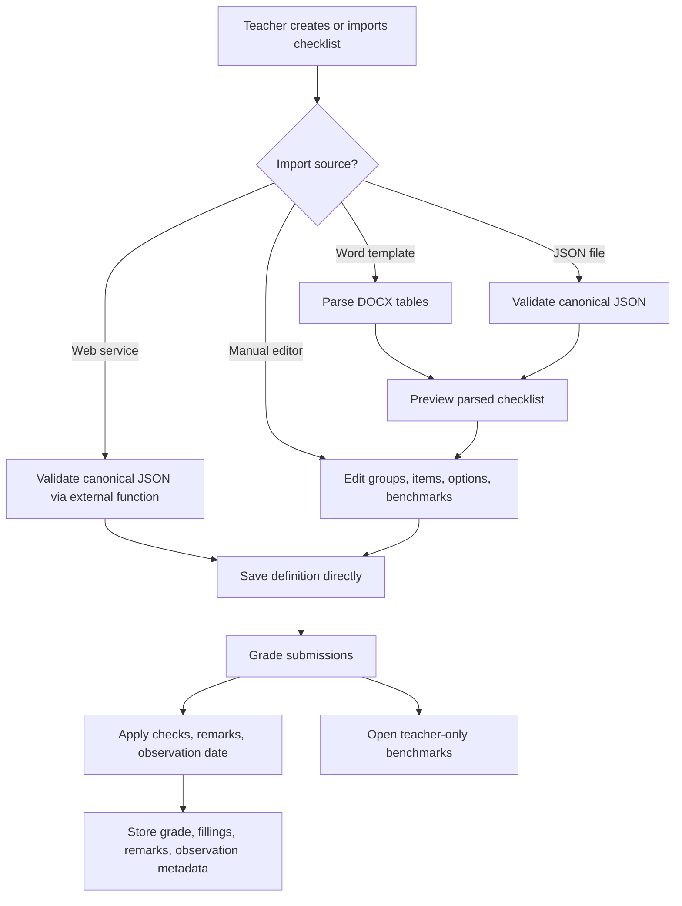
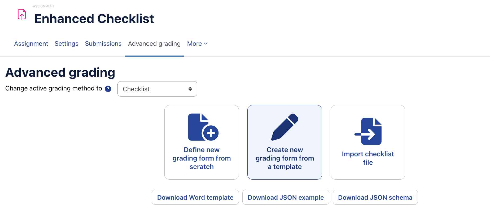
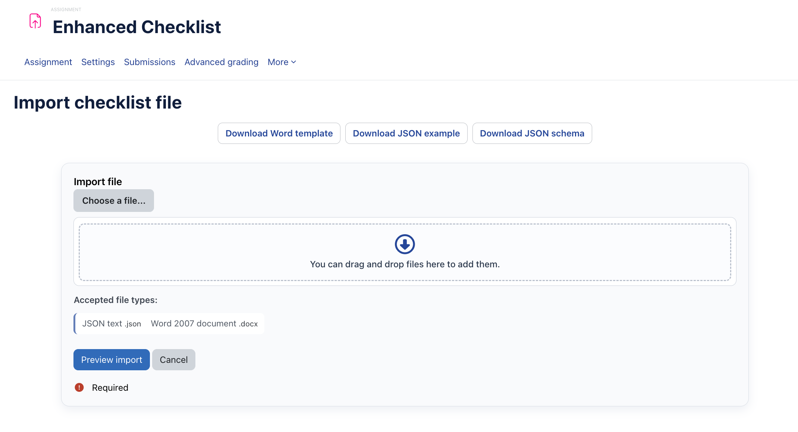
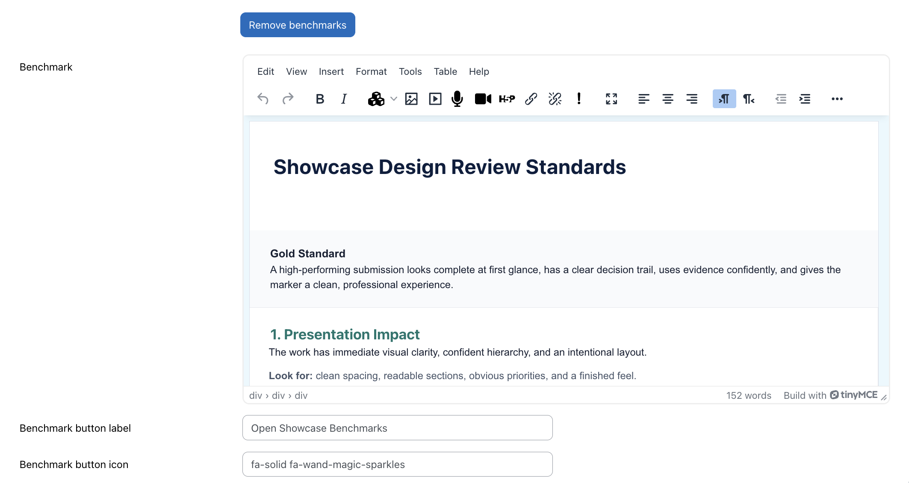
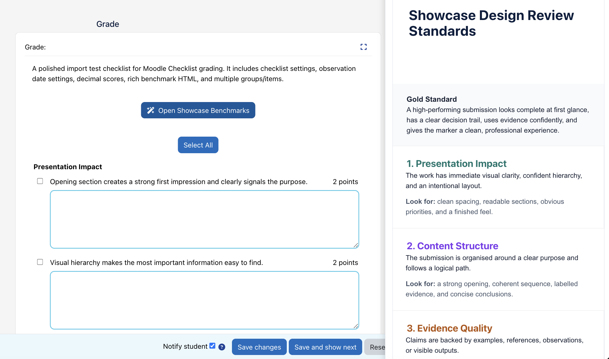

# Enhanced Checklist

Checklist is an advanced grading method for Moodle. Teachers build a checklist of
groups and items, assign points to each item, and use the checklist while grading
activities that support Moodle advanced grading, such as assignments and forums.
Checked items contribute to the final activity grade and are stored through
Moodle's grading framework.

Enhanced Checklist is a maintained, feature-rich replacement for the original
Open LMS Checklist grading form plugin:

- Original plugin:
  [open-lms-open-source/moodle-gradingform_checklist](https://github.com/open-lms-open-source/moodle-gradingform_checklist)
- Enhanced Checklist:
  [Portvgal/moodle-gradingform_checklist_enhanced](https://github.com/Portvgal/moodle-gradingform_checklist_enhanced)

The fork keeps the original checklist grading model, then adds richer authoring,
teacher-only benchmark guidance, import workflows, JSON automation, observation
dates, more grading options, and site-level controls.

The benchmark, import, JSON/web-service, observation date, configuration,
privacy, grader-panel, and testing improvements in this fork were designed and
implemented by John Braz
([@Portvgal](https://github.com/Portvgal)).

## Important: Replacement Plugin

Enhanced Checklist deliberately retains Moodle's `gradingform_checklist`
component name so existing Checklist definitions and grading data can be
upgraded in place. It is therefore a replacement for the Open LMS Checklist
plugin, not an additional grading method: **do not install both versions on the
same Moodle site**.

## What Enhanced Checklist Adds

| Area | Original Open LMS plugin | Benchmarks fork |
| --- | --- | --- |
| Checklist structure | Groups, items, item points, group ordering | Multiline group descriptions, multiline item definitions, item move up/down controls, configurable text limits |
| Grading workflow | Check items and calculate score | Bulk select/unselect, item and group remarks, required-comment rules, group and overall point display options |
| Teacher guidance | Checklist criteria only | Optional teacher-only benchmark guidance with configurable button label and Font Awesome icon |
| Import | Manual authoring in Moodle | Import from Word `.docx` template or canonical JSON, with preview before replacement |
| Automation | No checklist-definition import API | JSON web service function for external systems and bulk generation |
| Observation evidence | No dedicated observation date | Optional date or date-time selector saved with each grading instance |
| Administration | Plugin defaults mostly fixed in code | Site settings for feature availability, text limits, and defaults for new checklists |
| Privacy | Minimal/null declaration in older builds | Privacy metadata for checklist fills, remarks, benchmarks, and observation dates |
| Testing and packaging | Historical plugin tests | Expanded PHPUnit, Behat, backup/restore, importer, privacy, and grader-panel coverage |

## Feature Flow



## Requirements

- Moodle 4.5 or later, as declared in `version.php`.
- A Moodle activity that supports advanced grading.
- Standard Moodle PHP extensions for the target Moodle release.

The release package does not require Composer, Node.js, external credentials, or
any paid service after installation. Development checks may require the normal
Moodle development toolchain.

## Installation

Install the plugin directory as:

```text
grade/grading/form/checklist
```

Then upgrade Moodle:

```bash
php admin/cli/upgrade.php
```

or visit `admin/upgrade.php` as a site administrator.

After installation, go to:

```text
Site administration > Grades > Grading methods > Checklist
```

Configure feature availability, text limits, and defaults for new checklist
definitions before teachers start authoring production checklists.

Some Moodle versions do not load `settings.php` files from advanced grading
method plugins. If the Checklist settings page is not available after
installation, install the optional `local_checklistsettings` companion plugin.
It exposes the same settings through a local plugin while storing values in the
`gradingform_checklist` configuration namespace.

## Upgrading from Open LMS Checklist

Before upgrading a production site, take the normal Moodle database and
`moodledata` backups. Replace the existing
`grade/grading/form/checklist` directory with the Enhanced Checklist release
package, keeping the same directory name, then run the Moodle upgrade process.

The component name is unchanged, so Moodle applies the included upgrade steps
to existing Checklist data. Verify a representative checklist definition,
grading instance, backup/restore result, and privacy export after the upgrade
before enabling the new optional features for all authors.

## Administrator Settings

Settings are split into three practical groups.

### Checklist Limits

- Maximum group description length, default `500` characters.
- Maximum item definition length, default `1500` characters.

These limits apply when a checklist is created, edited, or imported. Changing a
limit does not rewrite or truncate existing definitions until they are saved or
imported again.

### Feature Availability

Administrators can enable or disable:

- Word `.docx` import.
- JSON file import.
- JSON web service import.
- Word template download.
- JSON example download.
- JSON Schema download.
- Benchmark guidance authoring.

Disabling a feature hides the related UI and blocks the related server-side
entry point. Existing checklist definitions are not rewritten by changing these
settings.

The JSON web service import is disabled by default. Enable it only when the site
is ready to expose checklist-definition import through Moodle web services.

### Defaults for New Checklists

Administrators can set defaults copied into newly created checklist definitions:

- Always show the checklist preview before grading.
- Show item points during grading.
- Show item points to students.
- Show group and total points during grading.
- Show group and total points to students.
- Allow item remarks.
- Allow group remarks.
- Show remarks to students.
- Allow bulk selection of checklist items.
- Require comments for checked items.
- Require at least one item comment.
- Require comments for groups with checked items.
- Require at least one group comment.
- Default group comment heading.
- Observation date selector mode: disabled, date only, or date and time.
- Default observation date: current date/time or blank.

Teachers can still change these options per checklist unless local role or site
policy prevents them from editing the grading form.

## Teacher Authoring Guide

Create or edit a checklist from the activity's advanced grading management page.
The fork adds several authoring improvements:

- Group descriptions and item definitions support multiline text.
- Individual items can be reordered with move up/down controls.
- Group-level comments can use a custom heading, such as `Criteria Comment`.
- Benchmark guidance can be added to the checklist definition.
- Import actions and downloadable authoring files are available from the grading
  method management/import area when enabled by the administrator.

### Benchmarks

Benchmarks are teacher-only guidance attached to the checklist definition. They
are intended for exemplars, marking notes, standardisation guidance, moderation
prompts, or local policy reminders that graders need while assessing.

When benchmarks are enabled, the teacher can configure:

- Benchmark content, stored as formatted Moodle editor content.
- Button label, default `Open to view Benchmarks`.
- Button icon, default `fa-solid fa-file-circle-check`.

During grading, graders open the benchmark guidance from the checklist panel.
Students do not see benchmark content or benchmark controls.

### Grading Options

Checklist definitions can enable:

- Bulk select/unselect of all checklist items.
- Item points shown to graders.
- Item points shown to students.
- Group and total points shown to graders.
- Group and total points shown to students.
- Item-level remarks.
- Group-level remarks.
- Remarks shown to students.
- Required item comments for every checked item.
- At least one item comment when any item is checked.
- Required group comments for groups with checked items.
- At least one group comment when any item is checked.

Required-comment settings automatically enable the relevant remark fields. For
example, requiring comments for checked items means item remarks must be
available while grading.

### Observation Date

The observation date option records when the assessed performance or evidence was
observed. It can be disabled, date-only, or date-and-time.

Use it when the grading event and the activity submission date are different, for
example practical assessment, placement observation, viva assessment, workplace
assessment, or moderation of an earlier live event.

The saved observation metadata is stored per grading instance and is covered by
the plugin privacy provider.

## Importing Checklists

Teachers with `moodle/grade:managegradingforms` in the target grading area can
import a replacement checklist definition from the advanced grading management
page.

Supported import sources:

- Word `.docx`, based on `docs/checklist-import-template.docx`.
- Canonical JSON, using format `gradingform_checklist_import`, version `1`.

The web import flow parses the uploaded file, shows a preview, and asks the
teacher to confirm replacement. If the checklist has not yet been used for
grading, the replacement is saved as draft so it can be reviewed. If the
checklist already has grading instances, the replacement is saved as ready and
existing grades are marked for review.

### Word Import

Use the supplied Word template as the starting point. The importer reads the
template tables before the heading:

```text
Reference Only - Do Not Import
```

Group and item table cells are treated as plain text. Rich content in those
cells is stripped. Benchmark guidance can include richer editor content, and Word
benchmark images are handled by the web import confirmation path.

Word import is best for teachers and learning designers who prefer to draft
checklists in a familiar document format before uploading them into Moodle.

### JSON Import

JSON import is best for integrations, repeatable templates, curriculum tooling,
bulk generation, and scripted checklist creation.

The plugin exposes downloadable files from the checklist management/import area:

- `checklist-import-example.json`
- `checklist-import.schema.json`

The schema is generated from the plugin's current limits and supported options,
so use the downloaded schema from the target site when validating payloads for a
specific Moodle installation.

Minimal JSON example:

```json
{
  "format": "gradingform_checklist_import",
  "version": 1,
  "name": "Research Brief Checklist",
  "description": "Assessment checklist for the research brief activity.",
  "settings": {
    "showitempointseval": 1,
    "showitempointstudent": 0,
    "enablegroupremarks": 1,
    "requiregroupcommentschecked": 1,
    "observationmode": "date",
    "observationdefault": "now"
  },
  "benchmark": {
    "enabled": true,
    "buttonlabel": "Open to view Benchmarks",
    "buttonicon": "fa-solid fa-file-circle-check",
    "html": "<p>Use this guidance when evaluating the submission.</p>",
    "files": []
  },
  "groups": [
    {
      "description": "Submission Requirements",
      "items": [
        {
          "definition": "Submitted by the due date",
          "score": 1
        }
      ]
    }
  ]
}
```

Important JSON rules:

- `format`, `version`, `name`, and `groups` are required.
- `format` must be `gradingform_checklist_import`.
- `version` must be `1`.
- Each group needs a non-empty `description` and at least one valid item.
- Each item needs a non-empty `definition` and a numeric `score`.
- Scores must be between `0` and `1000`.
- Settings can use internal option keys. The importer also recognises supported
  display labels from the Word template.
- Unknown settings are warnings, not fatal errors.
- JSON benchmark HTML is accepted.
- JSON embedded files are reserved for future support. In version 1, `files`
  must be empty for schema-valid JSON, and file payloads are ignored by JSON file
  import.

## Web Service Import

The fork adds this external function:

```text
gradingform_checklist_import_definition
```

Parameters:

| Parameter | Type | Required | Notes |
| --- | --- | --- | --- |
| `areaid` | integer | Yes | Advanced grading area id for the target activity area |
| `importjson` | string | Yes | Canonical checklist JSON payload |
| `status` | string | No | `draft` or `ready`, default `draft` |

Returns:

| Field | Type | Notes |
| --- | --- | --- |
| `definitionid` | integer | Imported grading definition id |
| `status` | string | Saved status, `draft` or `ready` |
| `warnings` | array | Moodle external warnings |

The function uses the same canonical JSON validator and save pipeline as the web
JSON importer. It requires:

- Site setting `Allow JSON web service import` enabled.
- Moodle web services configured for the calling client.
- A token or authenticated session for a user who can manage grading forms in
  the target context.
- Capability `moodle/grade:managegradingforms`.

Example REST call pattern:

```bash
curl "$MOODLE_URL/webservice/rest/server.php" \
  --data-urlencode "wstoken=$TOKEN" \
  --data-urlencode "wsfunction=gradingform_checklist_import_definition" \
  --data-urlencode "moodlewsrestformat=json" \
  --data-urlencode "areaid=123" \
  --data-urlencode "status=draft" \
  --data-urlencode "importjson@checklist-import.json"
```

If the target checklist already has active grading instances, the plugin saves
the replacement as ready and marks existing grades for review, even if the
request asked for draft. This protects graded work from silently drifting away
from the stored checklist definition.

## Data and Privacy

The plugin stores checklist data through Moodle's grading APIs and its own
checklist tables:

- Checklist groups and items attached to a grading definition.
- Checklist fillings for each grading instance.
- Checked item state.
- Optional item and group remarks plus text format.
- Teacher-only benchmark content, button label, and icon.
- Observation date metadata for each grading instance when enabled.

Imported source files are used to create or replace the checklist definition.
The plugin does not retain the uploaded Word or JSON source file after the import
flow completes.

The privacy provider describes, exports, and deletes checklist grading instance
data through Moodle's privacy API. Benchmark guidance is teacher-authored
definition metadata and should not contain private student information.

## Backup and Restore

Checklist definitions, groups, items, fillings, benchmarks, and observation
metadata are included in the plugin backup/restore path. After restoring a course
or activity, verify the checklist definition, benchmark visibility, observation
date display, and any existing grading instances.

## Release Packaging

Create release packages from Git rather than from a working directory:

```bash
git archive --format=zip --prefix=checklist/ HEAD -o checklist.zip
```

The package must include:

- `docs/checklist-import-template.docx`
- first-party AMD build output required by Moodle
- plugin PHP, language, template, style, backup, privacy, test, and database
  files

The package must not include:

- `.git`
- `.gitattributes`
- `.gitignore`
- `.DS_Store`
- source maps
- `docs/checklist-import-template-candidate.docx`
- generated local review reports

No bundled third-party JavaScript library is distributed by the current package,
so `thirdpartylibs.xml` is not required unless a future release adds third-party
code.

## Recommended Verification

Before installing on a production-like site, verify:

- Fresh install and upgrade with Moodle debugging enabled.
- Moodle PHPUnit tests for generator, restore, upgrade, importer, privacy, and
  grader-panel external functions.
- Checklist Behat grading workflow.
- Manual checklist editing with groups, items, benchmarks, point display,
  required comments, remarks, and observation dates.
- Word import from the supplied template.
- JSON file import from a schema-valid payload.
- JSON web service import with the feature disabled and enabled.
- Student view does not expose teacher-only benchmark guidance.
- Role boundaries for student, non-editing teacher, editing teacher, manager,
  and site administrator.
- Backup/restore and privacy export/delete.
- Keyboard navigation, focus handling, Escape/close behaviour, responsive
  benchmark panel/modal layout, and RTL display where relevant.

## Screenshots

A fuller set of sanitized screenshots is available in
[`docs/screenshots`](docs/screenshots). These examples show the main authoring,
import, benchmark, and grading workflows.

<table>
  <tr>
    <td width="50%">
      
      <br><strong>Advanced grading actions</strong>
    </td>
    <td width="50%">
      
      <br><strong>Checklist import</strong>
    </td>
  </tr>
  <tr>
    <td width="50%">
      
      <br><strong>Benchmark guidance editor</strong>
    </td>
    <td width="50%">
      
      <br><strong>Grader benchmark panel</strong>
    </td>
  </tr>
</table>

## Known Limitations

- JSON import format version 1 does not import embedded files.
- Word import is designed for the supplied template structure.
- Group and item text imported from Word is plain text.
- Benchmark guidance is teacher-only. Do not include private student examples in
  benchmark content or public screenshots.
- JSON web service import depends on Moodle web service configuration and the
  caller's Moodle capabilities.

## Credits

The original Checklist advanced grading method was contributed by the Open LMS
Product Development team.

Enhanced Checklist is maintained by John Braz
([@Portvgal](https://github.com/Portvgal)), who built the fork's benchmark
guidance, Word and JSON import workflow, JSON web service import endpoint,
observation date support, expanded grading options, administrator settings,
privacy provider updates, grader-panel improvements, and expanded test coverage.

## License

Copyright (c) 2021 Open LMS (https://www.openlms.net)

Copyright (c) 2026 John Braz
([@Portvgal](https://github.com/Portvgal)) for the benchmarks fork
modifications and added features.

This program is free software: you can redistribute it and/or modify it under
the terms of the GNU General Public License as published by the Free Software
Foundation, either version 3 of the License, or (at your option) any later
version.

This program is distributed in the hope that it will be useful, but WITHOUT ANY
WARRANTY; without even the implied warranty of MERCHANTABILITY or FITNESS FOR A
PARTICULAR PURPOSE. See the GNU General Public License for more details.

You should have received a copy of the GNU General Public License along with
this program. If not, see <http://www.gnu.org/licenses/>.

## Support

Source code and issue tracking are available in the
[GitHub repository](https://github.com/Portvgal/moodle-gradingform_checklist_enhanced)
and its
[issue tracker](https://github.com/Portvgal/moodle-gradingform_checklist_enhanced/issues).

Additional Moodle developer documentation is available from the
[Checklist developer documentation](https://docs.moodle.org/dev/Checklist).
